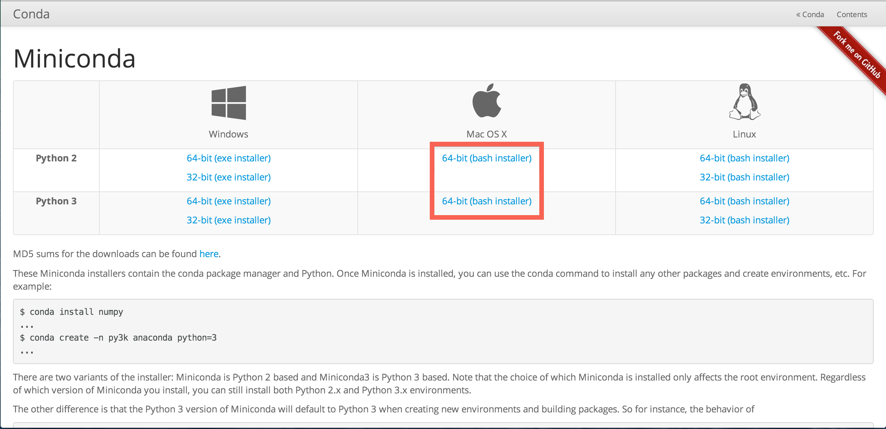
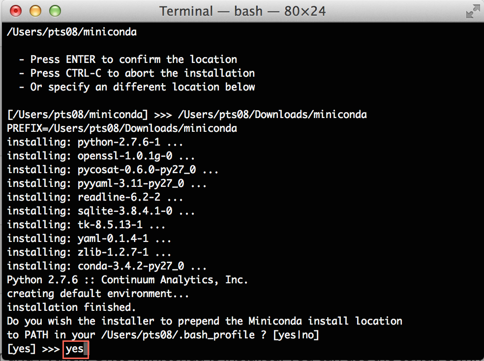
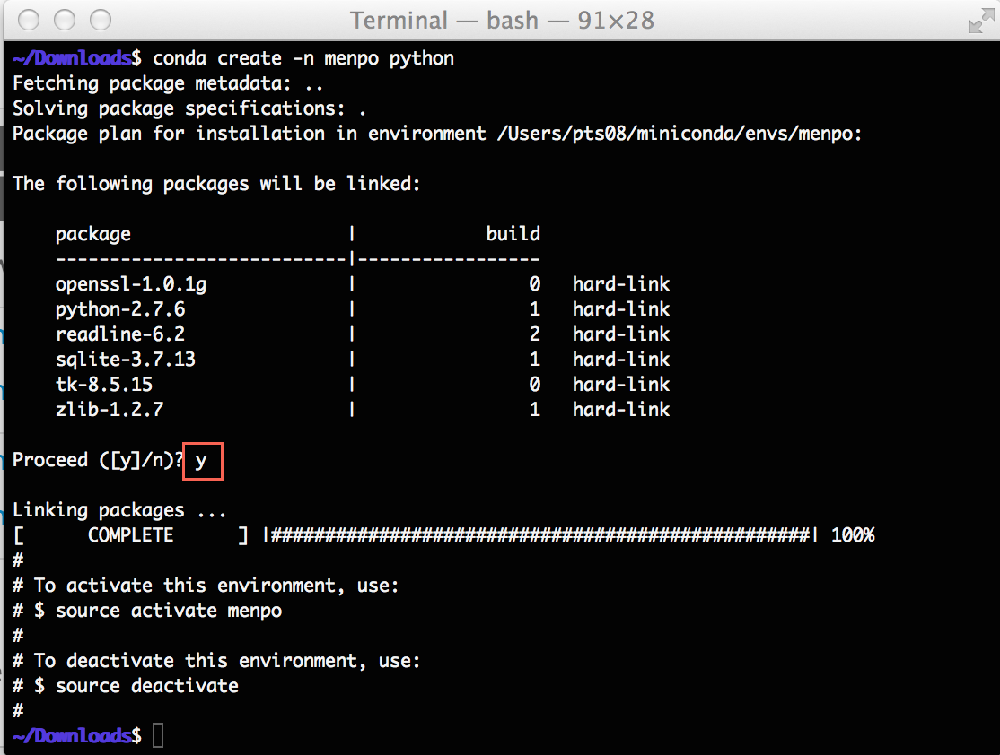
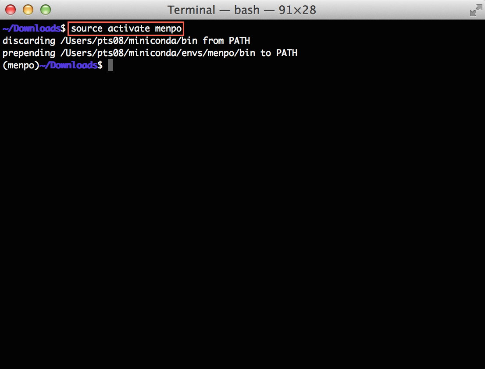
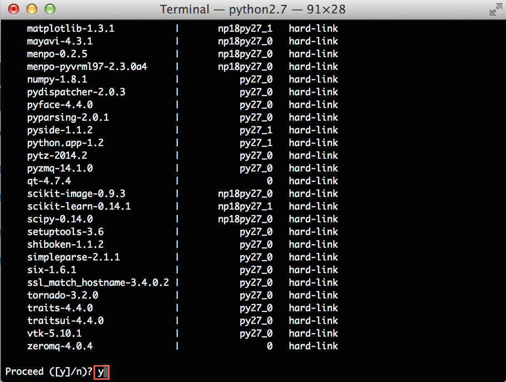
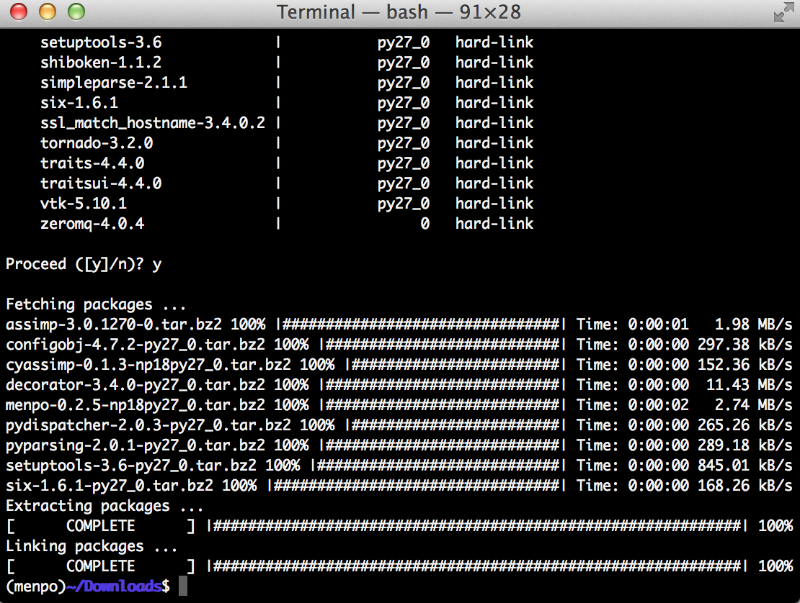

macOS Beginner Installation
==========================

**It is important to note that as part of the installation, you will be creating
an isolated environment to execute Python inside. Make sure that this
environment is activated in order to be able to use Menpo!**

The installation instructions are split up in to a number of sections. Please
follow them carefully, in order:

  1. [Prerequisites](#prerequisites)
  2. [Install A Python Environment](#install-a-python-environment)
  3. [Using Conda](#using-conda)
  4. [Setting Up A Fresh Environment](#setting-up-a-fresh-environment)
  5. [Installing The Menpo Project Into Conda](#installing-the-menpo-project-into-conda)
  6. [Begin Using Menpo](#begin-using-menpo)

### 1. Prerequisites {#prerequisites}
First, we need to install an isolated Python environment. Python does not come
with a graphical user interface and so we will need to run a number of commands
in the terminal. You can access the terminal by pressing **Command + Space**
to open spotlight and search for **terminal**.

********************************************************************************

********************************************************************************

We only support Menpo on the newer Intel Mac machines, all of which are 64-bit.
Therefore, we assume you are using one of these machines.

### 2. Install A Python Environment {#install-a-python-environment}
The Python environment we will use is called **conda**, and it is provided by
an installation package called **Miniconda**.

**[Download Miniconda from here](http://conda.pydata.org/miniconda.html)**

Download either the Python 2 or Python 3 copy of Miniconda for macOS.

********************************************************************************

********************************************************************************

After downloading Miniconda, you need to change to that directory within a
terminal so that we can run the installation shell script. Assuming that your
browser downloaded the script to `~/Downloads`, you can start the installer
by running:
```
$ cd ~/Downloads
$ chmod +x Miniconda2-latest-MacOSX-x86_64.sh
$ ./Miniconda2-latest-MacOSX-x86_64.sh
```
The name of the Miniconda **may** be different, but you just need to run `chmod`
in order to make the script executable. Once the installation has begun, accept
the license terms when prompted by typing **yes** and press **Enter** to accept
the default installation location. It is important that you say **yes** when
prompted whether or not the installer should prepend the Miniconda install
location to your **PATH**:

********************************************************************************

********************************************************************************

### 3. Using Conda {#using-conda}
After installing Miniconda, close your current terminal and open another in
order to activate the installation. You should have access to a new command
within the terminal, `conda`. You can test this is working by entering the
command
```
$ conda -V
```
Which will print something like ``conda 3.17.0``, though the version number *may*
differ.

### 4. Setting Up A Fresh Environment {#setting-up-a-fresh-environment}
We now need to create an environment to store all of our Python packages inside.
It doesn't matter what path you are within the terminal, the
`conda` command will not create any files *locally*. So, we use the command
```
$ conda create -n menpo python
```
This will inform you that you are creating a new environment and installing
Python inside of it. The environment name is given by `-n menpo` (the
environment will be called `menpo`) and only `python` and it's direct
dependencies will be installed inside by default.

To ensure you want to continue, Conda will prompt you
about if you wish to proceed. Type **y** and **Enter** to continue.
Conda will create a new environment for you and give you some information
about activating your new environment called `menpo`.

********************************************************************************

********************************************************************************

Now, activate the `menpo` environment with the command:
```
$ source activate menpo
```
********************************************************************************

********************************************************************************

Notice that the terminal is now prefixed with a label:
 ```
(menpo)$
```
This let's you know that the `menpo` environment is enabled. It is important
to ensure that the `menpo` environment is activated before attempting to
use Menpo in any way!

### 5. Installing The Menpo Project Into Conda {#installing-the-menpo-project-into-conda}
Installing all the packages of the Menpo Project only requires a single command:
```
(menpo)$ conda install -c conda-forge menpo menpofit menpodetect menpo3d
```
This will install `menpo`, `menpofit`, `menpodetect` and `menpo3d`.
If you do not need all Menpo packages, you can explicitly install any of them as:
```
(menpo)$ conda install -c conda-forge menpo
(menpo)$ conda install -c conda-forge menpofit
(menpo)$ conda install -c conda-forge menpodetect
(menpo)$ conda install -c conda-forge menpo3d
```
Conda will then attempt to install all of our requirements. It appears there are
many, but this is due to the minimal nature of the environment we originally
created. As before, Conda will prompt you to proceed, type **y** and press
**Enter** to continue.

********************************************************************************

********************************************************************************

It may take a short time to download and install all of Menpo's dependencies,
during which you will see a number of progress bars. The command is complete
when the extracting and linking processes show **COMPLETE**.

********************************************************************************

********************************************************************************

**Congratulations! You have now installed the latest version of the Menpo Project!**

### 6. Begin Using Menpo {#begin-using-menpo}
In order to start using Menpo, we suggest you have a look through our collection
of [Examples](../../examples/index.md) using Jupyter notebook. Follow the instructions there to download the notebooks and run them.

We strongly advise you to read the _User Guides_ for all the packages in order to
understand the basic concepts behind the Menpo Project. They can be found in:
- [`menpo`](../../menpo/index.md)
- [`menpodetect`](../../menpodetect/index.md)
- [`menpofit`](../../menpofit/index.md)
- [`menpocli`](../../menpocli/index.md)
- [`menpo3d`](../../menpo3d/index.md)

If you need more help you always ask on the
[menpo-users](https://groups.google.com/forum/#!forum/menpo-users "menpo-users") mailing list.
