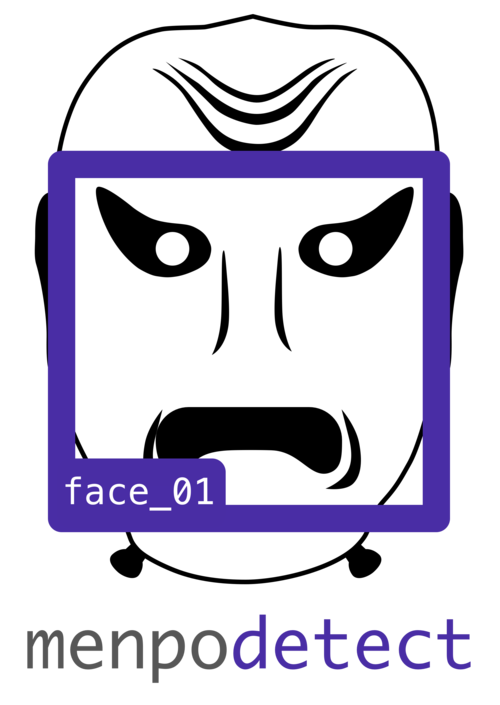

<link rel="stylesheet" type="text/css"  href="../menpostyle.css">

  
   
  

    
    <a style="text-decoration: none; color: grey; margin: 5px 25px;" href="https://github.com/menpo/menpodetect">
      <button class="download_button">View on Github</button>
    </a>
    
  

Simple object detection within the Menpo Project environment. We do not attempt
to implement novel techniques, but instead wrap existing projects so that they
integrate nicely with the rest of Menpo Project. At the moment the libraries that are wrapped include:

  - **[dlib](http://dlib.net/) (Boost Software License - Version 1.0)**  
    Frontal face detection, arbitrary dlib models and training code is all wrapped.
  - **[opencv](http://opencv.org/) (BSD)**
    Frontal face detection, profile face detection, eye detection and arbitrary `OpenCV` cascade files (via loading from disk) are all provided.
  - **[pico](https://github.com/nenadmarkus/pico) (Academic Only)**
    Frontal face detection and arbitrary pico models are provided. Loading arbitrary `Pico` models is likely to be very difficult, however.
  - **[ffld2](http://charles.dubout.ch/en/index.html) (GNU AGPL)**
    Frontal face detection using the `DPM` Baseline model provided by [Mathias et. al.](http://markusmathias.bitbucket.org/2014_eccv_face_detection/).
    Training code is also wrapped, but requires explicit negative samples.
