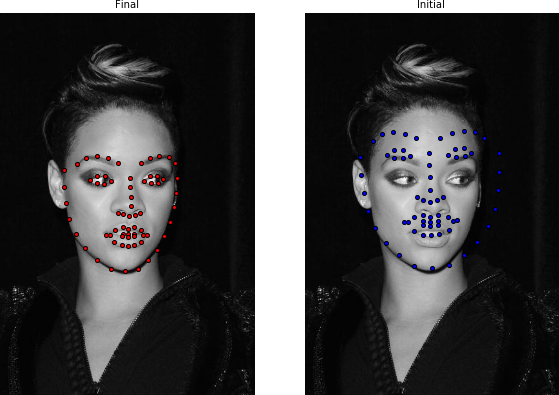
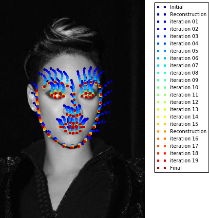
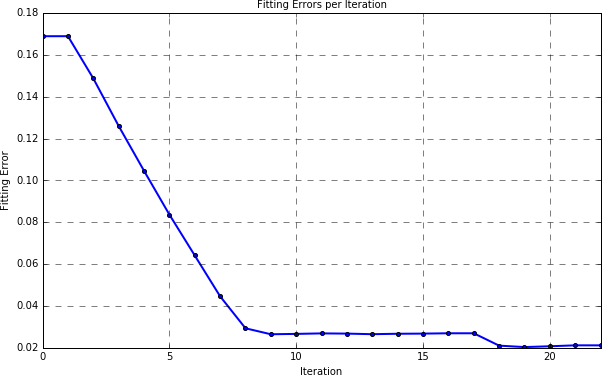
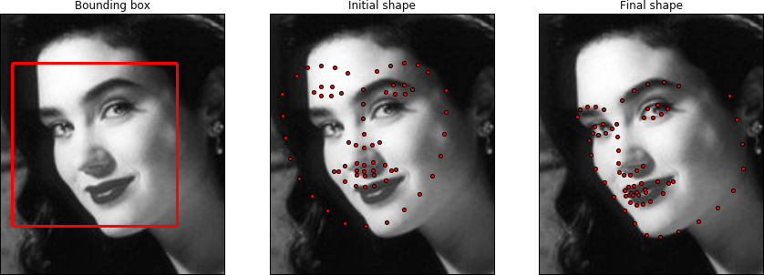

Active Appearance Model
=======================

1. [Definition](#definition)
2. [Warp Functions](#warp)
3. [Cost Function and Optimization](#cost)  
   3.1. [Lucas-Kanade Optimization](#lucas-kanade-fitting)  
   3.2. [Supervised Descent Optimization](#supervised-descent-fitting)
4. [Fitting Example](#fitting)
5. [References](#references)
6. <a href="http://menpofit.readthedocs.io/en/stable/api/menpofit/aam/index.html">API Documentation <i class="fa fa-external-link fa-lg"></i></a>

---------------------------------------

<p><div style="background-color: #F2DEDE; width: 100%; border: 1px solid #A52A2A; padding: 1%;">
<p style="float: left;"><i class="fa fa-exclamation-circle" aria-hidden="true" style="font-size:4em; padding-right: 15%; padding-bottom: 10%; padding-top: 10%;"></i></p>
We highly recommend that you render all matplotlib figures <b>inline</b> the Jupyter notebook for the best <a href="../menpowidgets/index.md"><em>menpowidgets</em></a> experience.
This can be done by running</br>
<center><code>%matplotlib inline</code></center>
in a cell. Note that you only have to run it once and not in every rendering cell.
</div></p>

### 1. Definition {#definition}
Active Appearance Model (AAM) is a statistical deformable model of the shape and appearance of a deformable object class.
It is a generative model which during fitting aims to recover a parametric description of a certain object through optimization.
In this page, we provide a basic mathematical definition of an AAM and all its variations that are implemented within `menpofit`.
For a more in-depth explanation of AAM, please refer to the relevant literature in [References](#references) and especially [[1](#1)].

A shape instance of a deformable object is represented as $$\mathbf{s}=\big[x_1,y_1,\ldots,x_L,y_L\big]^{\mathsf{T}}$$, a $$2L\times 1$$ vector consisting of $$L$$ landmark points coordinates $$(x_i,y_i),\forall i=1,\ldots,L$$. An AAM [[6](#6), [8](#8)] is trained using a set of $$N$$ images $$\big\lbrace\mathbf{I}_1,\mathbf{I}_2,\ldots,\mathbf{I}_N\big\rbrace$$ that are annotated with a set of
$$L$$ landmarks and it consists of the following parts:

* **Shape Model**  
  The shape model is trained as explained in the [Point Distributon Model section](pdm.md "Point Distribution Model basics"). The training shapes $$\big\lbrace\mathbf{s}_1,\mathbf{s}_2,\ldots,\mathbf{s}_N\big\rbrace$$ are first aligned using Generalized Procrustes Analysis and then an orthonormal basis is created using Principal Component Analysis (PCA) which is further augmented with four eigenvectors that represent the similarity transform (scaling, in-plane rotation and translation). This results in
  $$
  \big\lbrace\bar{\mathbf{s}}, \mathbf{U}_s\big\rbrace
  $$
  where $$\mathbf{U}_s\in\mathbb{R}^{2L\times n}$$ is the orthonormal basis of $$n$$ eigenvectors (including the four similarity components) and $$\bar{\mathbf{s}}\in\mathbb{R}^{2L\times 1}$$ is the mean shape vector. An new shape instance can be generated as $$\mathbf{s}_{\mathbf{p}}=\bar{\mathbf{s}} + \mathbf{U}_s\mathbf{p}$$, where $$\mathbf{p}=\big[p_1,p_2,\ldots,p_n\big]^{\mathsf{T}}$$ is the vector of shape parameters.


  * **Motion Model**  
  The motion model consists of a warp function $$\mathcal{W}(\mathbf{p})$$ which is essential for warping the texture related to a shape instance generated with parameters $$\mathbf{p}$$ into a common `reference_shape`. The `reference_shape` is by default the mean shape $$\bar{\mathbf{s}}$$, however you can pass in a `reference_shape` of your preference during construction of the AAM.


  * **Appearance Model**  
  The appearance model is trained by:
    1. First extracting features from all the training images using the features function $$\mathcal{F}()$$ defined by `holistic_features`, i.e. $$\mathcal{F}(\mathbf{I}_i)$$, $$\forall i=1,\ldots,N$$
    2. Warping the feature-based images into the `reference_shape` in order to get $$\mathcal{F}(\mathbf{I}_i)(\mathcal{W}(\mathbf{p}_i))$$, $$\forall i=1,\ldots,N$$
    3. Vectorizing the warped images as $$\mathbf{a}_i= \mathcal{F}(\mathbf{I}_i)(\mathcal{W}(\mathbf{p}_i))$$, $$\forall i=1,\ldots,N$$ where $$\mathbf{a}_i\in\mathbb{R}^{M\times 1}$$
    4. Applying PCA on the acquired vectors which results in
    $$
    \big\lbrace\bar{\mathbf{a}}, \mathbf{U}_a\big\rbrace
    $$
    where $$\mathbf{U}_a\in\mathbb{R}^{M\times m}$$ is the orthonormal basis of $$m$$ eigenvectors and $$\bar{\mathbf{a}}\in\mathbb{R}^{M\times 1}$$ is the mean appearance vector.

  A new appearance instance can be generated as $$\mathbf{a}_{\mathbf{c}}=\bar{\mathbf{a}} + \mathbf{U}_a\mathbf{c}$$, where $$\mathbf{c}=\big[c_1,c_2,\ldots,c_m\big]^{\mathsf{T}}$$ is the vector of appearance parameters.

Before continuing, let's load the trainset of LFPW (see [Importing Images](importing.md "Basics on how to import images") for download instructions) as
```python
import menpo.io as mio
from menpo.visualize import print_progress
from menpo.landmark import labeller, face_ibug_68_to_face_ibug_68_trimesh

path_to_images = '/path/to/lfpw/trainset/'
training_images = []
for img in print_progress(mio.import_images(path_to_images, verbose=True)):
    # convert to greyscale
    if img.n_channels == 3:
        img = img.as_greyscale()
    # crop to landmarks bounding box with an extra 20% padding
    img = img.crop_to_landmarks_proportion(0.2)
    # rescale image if its diagonal is bigger than 400 pixels
    d = img.diagonal()
    if d > 400:
        img = img.rescale(400.0 / d)
    # define a TriMesh which will be useful for Piecewise Affine Warp of HolisticAAM
    labeller(img, 'PTS', face_ibug_68_to_face_ibug_68_trimesh)
    # append to list
    training_images.append(img)
```
Note that we labeled the images using `face_ibug_68_to_face_ibug_68_trimesh`, in order to
get a manually defined `TriMesh` for the Piecewise Affine Warp. However, this is not necessary and it only applies
for `HolisticAAM`. We can visualize the images using an interactive widget as:
```python
%matplotlib inline
from menpowidgets import visualize_images
visualize_images(training_images)
```
<video width="100%" autoplay loop>
  <source src="media/visualize_images_lfpw_trimesh.mp4" type="video/mp4">
Your browser does not support the video tag.
</video>


### 2. Warp Functions {#warp}
With an abuse of notation, let us define
$$
\mathbf{t}(\mathcal{W}(\mathbf{p}))\equiv \mathcal{F}(\mathbf{I})(\mathcal{W}(\mathbf{p}))
$$
as the feature-based warped $$M\times 1$$ vector of an image $$\mathbf{I}$$ given its shape instance generated with parameters $$\mathbf{p}$$.

`menpofit` provides five different AAM versions, which differ on the way that this appearance warping $$\mathbf{t}(\mathcal{W}(\mathbf{p}))$$ is performed.
Specifically:

**HolisticAAM**  
The `HolisticAAM` uses a holistic appearance representation obtained by warping the texture into the reference frame
with a non-linear warp function $$\mathcal{W}(\mathbf{p})$$. Two such warp functions are currently supported:
Piecewise Affine Warp and Thin Plate Spline. The reference frame is the mask of the mean shape's convex hull.
Let's create a `HolisticAAM` using Dense SIFT features:
```python
from menpofit.aam import HolisticAAM
from menpo.feature import fast_dsift

aam = HolisticAAM(training_images, group='face_ibug_68_trimesh', diagonal=150,
                  scales=(0.5, 1.0), holistic_features=fast_dsift, verbose=True,
                  max_shape_components=20, max_appearance_components=150)
```
and visualize it:
```python
aam.view_shape_models_widget()
```
<video width="100%" autoplay loop>
  <source src="media/view_shape_models_widget.mp4" type="video/mp4">
Your browser does not support the video tag.
</video>

```python
aam.view_appearance_models_widget()
```
<video width="100%" autoplay loop>
  <source src="media/holistic_aam_view_appearance_models_widget.mp4" type="video/mp4">
Your browser does not support the video tag.
</video>

```python
aam.view_aam_widget()
```
<video width="100%" autoplay loop>
  <source src="media/holistic_aam_view_aam_widget.mp4" type="video/mp4">
Your browser does not support the video tag.
</video>

**MaskedAAM**  
The `MaskedAAM` uses the same warp logic as the `HolsiticAAM`. The only difference between them is that the
reference frame consists of rectangular mask patches centered around the landmarks instead of the convex hull of the mean shape.

**LinearAAM**  
The `LinearAAM` is an experimental variation that utilizes a linear warp function $$\mathcal{W}(\mathbf{p})$$ in the motion model, thus a _dense_ statistical shape model which has one shape point per pixel in the reference frame. The advantage is that the linear nature of such warp function makes the computation of its Jacobian trivial.

**LinearMaskedAAM**  
Similar to the relation between `HolisticAAM` and `MaskedAAM`, a `LinearMaskedAAM` is exactly the same with a
`LinearAAM`, with the difference that the reference frame is masked.

**PatchAAM**  
A `PatchAAM` represents the appearance in a patch-based fashion, i.e. rectangular patches are extracted around the landmark points.
Thus, the warp function $$\mathbf{t}(\mathcal{W}(\mathbf{p}))$$ simply _samples_ the patches centered around the landmarks of the shape instance generated with parameters $$\mathbf{p}$$.
Let's create a `PatchAAM` using Dense SIFT features:
```python
from menpofit.aam import PatchAAM
from menpo.feature import fast_dsift

patch_aam = PatchAAM(training_images, group='PTS', patch_shape=[(15, 15), (23, 23)],
                     diagonal=150, scales=(0.5, 1.0), holistic_features=fast_dsift,
                     max_shape_components=20, max_appearance_components=150,
                     verbose=True)
```
and visualize it:
```python
patch_aam.view_appearance_models_widget()
```
<video width="100%" autoplay loop>
  <source src="media/patch_aam_view_appearance_models_widget.mp4" type="video/mp4">
Your browser does not support the video tag.
</video>

```python
patch_aam.view_aam_widget()
```
<video width="100%" autoplay loop>
  <source src="media/patch_aam_view_aam_widget.mp4" type="video/mp4">
Your browser does not support the video tag.
</video>


### 3. Cost Function and Optimization {#cost}
Fitting an AAM on a test image involves the optimization of the following cost function
$$
\arg\min_{\mathbf{p}, \mathbf{c}} \big\lVert \mathbf{t}(\mathcal{W}(\mathbf{p})) - \bar{\mathbf{a}} - \mathbf{U}_a\mathbf{c} \big\rVert^{2}
$$
with respect to the shape and appearance parameters. Note that this cost function is very similar to the one of [Lucas-Kanade](lk.md "Lucas-Kanade Affine Image Alignment") for Affine Image Alignment and [Active Template Model](atm.md "Active Template Model (ATM)") for Deformabe Image Alignment. The only difference has to do with the fact that an AAM aims to align the test image with a linear appearance model.

This optimization can be solved by two approaches:
1. [Lucas-Kanade Optimization](#lucas-kanade-fitting)  
2. [Supervised Descent Optimization](#supervised-descent-fitting)

#### 3.1. Lucas-Kanade Optimization {#lucas-kanade-fitting}
The Lucas-Kanade optimization belongs to the family of gradient-descent algorithms. In general, the existing gradient descent optimization techniques are categorized as: (1) _forward_ or _inverse_ depending on the direction of the motion parameters estimation and (2) _additive_ or _compositional_ depending on the way the motion parameters are updated. `menpofit` currently provides the **Forward-Compositional** and **Inverse-Compositional** version of five different algorithms. All these algorithms are iterative and the shape parameters are updated at each iteration in a compositional manner as
$$
\mathcal{W}(\mathbf{p})\leftarrow\mathcal{W}(\mathbf{p})\circ\mathcal{W}(\Delta\mathbf{p})^{-1}
$$

Below we briefly present the Inverse-Compositional of each one of them, however the Forward-Compositional can be derived in a similar fashion.

* **Project-Out**  
  The Project-Out Inverse-Compositional algorithm [[8](#8)] decouples shape and appearance by solving the AAM optimization problem in a subspace orthogonal to the appearance variation. This is achieved by "projecting-out" the appearance variation, thus working on the orthogonal complement of the appearance subspace $$\hat{\mathbf{U}}_a=\mathbf{I}_{eye}-\mathbf{U}_a\mathbf{U}_a^{\mathsf{T}}$$. The cost function has the form
  $$
  \arg\min_{\Delta\mathbf{p}} \Big\lVert \mathbf{t}\left(\mathcal{W}\left(\mathbf{p}\right)\right) - \bar{\mathbf{a}}\left(\mathcal{W}\left(\Delta\mathbf{p}\right)\right) \Big\rVert^{2}_{\hat{\mathbf{U}}_a}
  $$
  By taking the first-order Taylor expansion on the part of the model over $$\Delta\mathbf{p} = \mathbf{0}$$ we get $$\bar{\mathbf{a}}(\mathcal{W}(\Delta\mathbf{p})) \approx \bar{\mathbf{a}} + \nabla{\bar{\mathbf{a}}}{\left.\frac{\partial\mathcal{W}}{\partial\mathbf{p}}\right|}_{\mathbf{p}=\mathbf{0}}\Delta\mathbf{p}$$.
  Thus, the incermental update of the shape parameters is computed as
  $$
  \Delta\mathbf{p} = \mathbf{H}^{-1}\mathbf{J}^{\mathsf{T}}\big[\mathbf{t}(\mathcal{W}(\mathbf{p})) - \bar{\mathbf{a}}\big]
  $$
  where $$\mathbf{H}=\mathbf{J}^{\mathsf{T}}\mathbf{J}$$ is the Gauss-Newton approximation of the Hessian matrix and
  $$\mathbf{J} = \hat{\mathbf{U}}_a\nabla{\bar{\mathbf{a}}}{\left.\frac{\partial\mathcal{W}}{\partial\mathbf{p}}\right|}_{\mathbf{p}=\mathbf{0}}$$ is the projected-out Jacobian. The appearance parameters can be retrieved at the end of the iterative optimization as $$\mathbf{c}=\mathbf{U}_a^{\mathsf{T}}\big[\mathbf{t}(\mathcal{W}(\mathbf{p}))-\bar{\mathbf{a}}\big]$$ in order to reconstruct the appearance. Note that the Jacobian, Hessian and its inverse are constant and can be pre-computed, which makes the Project Out Inverse Compositional fast with computational cost $$\mathcal{O}\big(nM\big)$$.


* **Simultaneous**  
  In the Simultaneous Inverse-Compositional algorithm [[7](#7)], we aim to optimize simultaneously for the shape $$\mathbf{p}$$ and the appearance $$\mathbf{c}$$ parameters. The cost function has the form
  $$
  \arg\min_{\Delta\mathbf{p},\Delta\mathbf{c}} \Big\lVert  \mathbf{t}(\mathcal{W}(\mathbf{p})) - \bar{\mathbf{a}}(\mathcal{W}(\Delta\mathbf{p})) - \sum_{i=1}^{m} (c_i + \Delta c_i) \mathbf{u}_i(\mathcal{W}(\Delta\mathbf{p})) \Big\rVert^{2}
  $$
  where $$\mathbf{u}_i$$ are the appearance eigenvectors, i.e. $$\mathbf{U}_a = \big[\mathbf{u}_1, \mathbf{u}_2, \ldots, \mathbf{u}_m\big]$$. Note that the appearance parameters are updated in an additive manner, i.e. $$\mathbf{c}\leftarrow\mathbf{c}+\Delta\mathbf{c}$$. We denote by $$\Delta\mathbf{q}=\big[\Delta\mathbf{p}^{\mathsf{T}},\Delta\mathbf{c}^{\mathsf{T}}\big]^{\mathsf{T}}$$ the vector of concatenated parameters increments with length $$n+m$$. The linearization of the model part around $$\Delta\mathbf{p}=\mathbf{0}$$ consists of two parts:
  the mean appearance vector approximation
  $$\bar{\mathbf{a}}(\mathcal{W}(\Delta\mathbf{p})) \approx \bar{\mathbf{a}} + \nabla{\bar{\mathbf{a}}}{\left.\frac{\partial\mathcal{W}}{\partial\mathbf{p}}\right|}_{\mathbf{p}=\mathbf{0}}\Delta\mathbf{p}$$
  and the linearized basis $$\sum_{i=1}^{m} (c_i + \Delta c_i) \mathbf{u}_i(\mathcal{W}(\Delta\mathbf{p})) \approx \sum_{i=1}^{m} (c_i + \Delta c_i) \left(\mathbf{u}_i + \nabla\mathbf{u}_i{\left.\frac{\partial\mathcal{W}}{\partial\mathbf{p}}\right|}_{\mathbf{p}=\mathbf{0}}\Delta\mathbf{p}\right)$$. Then the final solution at each iteration is
  $$
  \Delta\mathbf{q} = \mathbf{H}^{-1}\mathbf{J}^{\mathsf{T}}\big[\mathbf{t}(\mathcal{W}(\mathbf{p}))-\bar{\mathbf{a}}-\mathbf{U}_a\mathbf{c}\big]
  $$
  where the Hessian matrix is $$\mathbf{H}=\mathbf{J}^{\mathsf{T}}\mathbf{J}$$ and the Jacobian is given by $$\mathbf{J}=\big[\mathbf{U}_a, \mathbf{J}_a\big]$$ with $$\mathbf{J}_a = \nabla{\bar{\mathbf{a}}}{\left.\frac{\partial\mathcal{W}}{\partial\mathbf{p}}\right|}_{\mathbf{p}=\mathbf{0}} + \sum_{i=1}^{m}c_i \nabla\mathbf{u}_i{\left.\frac{\partial\mathcal{W}}{\partial\mathbf{p}}\right|}_{\mathbf{p}=\mathbf{0}}$$.
  The Jacobian of the mean appearance vector and the eigenvectors are constant and can be precomputed. However, the total Jacobian $$\mathbf{J}_a$$ and hence the Hessian matrix depend on the current estimate of the appearance parameters $$\mathbf{c}$$, thus they need to be computed at every iteration. The computational complexity is $$\mathcal{O}\big((n+m)^2M+mM+(n+m)^3\big)$$.


* **Alternating**  
  In the Alternating Inverse-Compositional algorithm [[9](#9), [12](#12), [13](#13), [2](#2)], the cost function has the same form as in the case of Simultaneous Inverse-Compositional, i.e.
  $$
  \arg\min_{\Delta\mathbf{p},\Delta\mathbf{c}} \Big\lVert  \mathbf{t}(\mathcal{W}(\mathbf{p})) - \bar{\mathbf{a}}(\mathcal{W}(\Delta\mathbf{p})) - \sum_{i=1}^{m} (c_i + \Delta c_i) \mathbf{u}_i(\mathcal{W}(\Delta\mathbf{p})) \Big\rVert^{2}
  $$
  where $$\mathbf{u}_i$$ are the appearance eigenvectors, i.e. $$\mathbf{U}_a = \big[\mathbf{u}_1, \mathbf{u}_2, \ldots, \mathbf{u}_m\big]$$. The linearization also has the exact same formulation. The only difference is that we optimize with respect to $$\Delta\mathbf{p}$$ and $$\Delta\mathbf{c}$$ in an alternated manner instead of simultaneously. Specifically, assuming that we have the current estimation of $$\Delta\mathbf{p}$$, the appearance parameters incremental is computed as
  $$
  \Delta\mathbf{c} = \mathbf{U}_a^{\mathsf{T}}\big[\mathbf{t}(\mathcal{W}(\mathbf{p})) - \bar{\mathbf{a}} - \mathbf{U}_a\mathbf{c} - \mathbf{J}_a\Delta\mathbf{p}\big]
  $$
  Then, given the current estimate of $$\Delta\mathbf{c}$$, the shape parameters increment is comptuted as
  $$
  \Delta\mathbf{p}=\mathbf{H}^{-1}\mathbf{J}_a^{\mathsf{T}}\big[\mathbf{t}(\mathcal{W}(\mathbf{p})) - \bar{\mathbf{a}} - \mathbf{U}_a(\mathbf{c}+\Delta\mathbf{c})\big]
  $$
  Note that the appearance parameters vector is updated in an additive fashion, i.e. $$\mathbf{c}\leftarrow\mathbf{c}+\Delta\mathbf{c}$$.
  As in the Simultaneous case, the Jacobian is given by $$\mathbf{J}_a = \nabla{\bar{\mathbf{a}}}{\left.\frac{\partial\mathcal{W}}{\partial\mathbf{p}}\right|}_{\mathbf{p}=\mathbf{0}} + \sum_{i=1}^{m}c_i \nabla\mathbf{u}_i{\left.\frac{\partial\mathcal{W}}{\partial\mathbf{p}}\right|}_{\mathbf{p}=\mathbf{0}}$$ and the Hessian matrix is $$\mathbf{H} = \mathbf{J}_a^{\mathsf{T}}\mathbf{J}_a$$. The computational complexity is $$\mathcal{O}\big((n^2+m+n)M+n^3\big)$$.


* **Modified Alternating**  
  The Modified Alternating Inverse-Compositional algorithm is very similar to the Alternating case. The only difference is that we do not introduce an incremental update on the appearance parameters. Instead, the current appearance parameters vector $$\Delta\mathbf{c}$$ is computed by projecting the input image with shape parameters $$\mathbf{p}$$ into the appearance subspace. Specifically, the shape parameters increment given the current estimate of the appearance parameters $$\mathbf{c}$$ is given by
  $$
  \Delta\mathbf{p}=\mathbf{H}^{-1}\mathbf{J}_a^{\mathsf{T}}\big[\mathbf{t}(\mathcal{W}(\mathbf{p})) - \bar{\mathbf{a}} - \mathbf{U}_a\mathbf{c}\big]
  $$
  Then, the appearance parameters for the next iteration are obtained by projecting $$\mathbf{t}(\mathcal{W}(\mathbf{p}))$$ into the appearance model as
  $$
  \mathbf{c} = \mathbf{U}_a^{\mathsf{T}}\big[\mathbf{t}(\mathcal{W}(\mathbf{p})) - \bar{\mathbf{a}}\big]
  $$
  The Jacobian and Hessian are the same as in the Alternating case, i.e. $$\mathbf{H} = \mathbf{J}_a^{\mathsf{T}}\mathbf{J}_a$$ and $$\mathbf{J}_a = \nabla{\bar{\mathbf{a}}}{\left.\frac{\partial\mathcal{W}}{\partial\mathbf{p}}\right|}_{\mathbf{p}=\mathbf{0}} + \sum_{i=1}^{m}c_i \nabla\mathbf{u}_i{\left.\frac{\partial\mathcal{W}}{\partial\mathbf{p}}\right|}_{\mathbf{p}=\mathbf{0}}$$. The computational complexity is $$\mathcal{O}\big((n^2+m)M+n^3\big)$$ which is very similar to the Alternating.


* **Wiberg**  
  The Wiberg Inverse-Compositional algorithm [[9](#9), [13](#13), [11](#11)] is a very efficient version of alternating optimization. It involves solving two different problems in an alternating manner, one for the shape and one for the appearance parameters increments
  $$
  \left\lbrace\begin{aligned}
  \arg\min_{\Delta\mathbf{p}} & \Big\lVert \mathbf{t}(\mathcal{W}(\mathbf{p})) - \bar{\mathbf{a}}(\mathcal{W}(\Delta\mathbf{p})) - \sum_{i=1}^{m} c_i \mathbf{u}_i(\mathcal{W}(\Delta\mathbf{p})) \Big\rVert^{2}_{\hat{\mathbf{U}}_a}\\
  \arg\min_{\Delta\mathbf{c}} & \Big\lVert \mathbf{t}(\mathcal{W}(\mathbf{p})) - \bar{\mathbf{a}}(\mathcal{W}(\Delta\mathbf{p})) - \sum_{i=1}^{m} (c_i + \Delta c_i) \mathbf{u}_i(\mathcal{W}(\Delta\mathbf{p})) \Big\rVert^{2}
  \end{aligned}\right.
  $$
  where $$\hat{\mathbf{U}}_a=\mathbf{I}_{eye}-\mathbf{U}_a\mathbf{U}_a^{\mathsf{T}}$$ is the "project-out" operator. Given the current estimate of $$\Delta\mathbf{c}$$, the shape parameters increment estimated by solving the first optimization problem as
  $$
  \Delta\mathbf{p} = \hat{\mathbf{H}}^{-1} \hat{\mathbf{J}}_a^{\mathsf{T}} \big[\mathbf{t}(\mathcal{W}(\mathbf{p})) - \bar{\mathbf{a}}\big]
  $$
  where $$\hat{\mathbf{J}}_a = \hat{\mathbf{U}}_a \mathbf{J}_a$$ is the projected-out Jacobian with $$\mathbf{J}_a = \nabla{\bar{\mathbf{a}}}{\left.\frac{\partial\mathcal{W}}{\partial\mathbf{p}}\right|}_{\mathbf{p}=\mathbf{0}} + \sum_{i=1}^{m}c_i \nabla\mathbf{u}_i{\left.\frac{\partial\mathcal{W}}{\partial\mathbf{p}}\right|}_{\mathbf{p}=\mathbf{0}}$$ and $$\hat{\mathbf{H}}=\hat{\mathbf{J}}_a^{\mathsf{T}}\hat{\mathbf{J}}_a$$ being the Gauss-Newton approximation of the Hessian. Given the current estimate of $$\Delta\mathbf{p}$$, the appearance parameters increment is computed by solving the second optimization problem as
  $$
  \Delta\mathbf{c} = \mathbf{U}_a^{\mathsf{T}}\big[\mathbf{t}(\mathcal{W}(\mathbf{p})) - \bar{\mathbf{a}} - \mathbf{U}_a\mathbf{c} - \mathbf{J}_a\Delta\mathbf{p}\big]
  $$
  The computational cost of Wiberg optimization is $$\mathcal{O}\big((nm+n^2)M\big)$$, as shown in [[13](#13)]. Note that Wiberg and Simultaneous have been shown to be theoretically equivalent and that the only difference is their computational costs. That is the Simultaneous Inverse-Compositional algorithm requires to invert the Hessian of the concatenated shape and appearance parameters ($$\mathcal{O}\big((n + m)^3\big)$$). However, using the fact that $$\min_{x,y} f(x,y) = \min_{x} \big(\min_{y} f(x,y)\big)$$ and solving first for the appearance parameter increments, it has been shown that the complexity of Simultaneous can be reduced dramatically and that Simultaneous is equivalent to Wiberg algorithm [[13](#13)] (similar results can be shown by using the Schur’s complement of the Hessian of shape and appearance parameters).


Let's now create a Lucas-Kanade Fitter for the patch-based AAM that we trained above using the Wiberg Inverse-Compositional algorithm, as
```python
from menpofit.aam import LucasKanadeAAMFitter, WibergInverseCompositional

fitter = LucasKanadeAAMFitter(patch_aam, lk_algorithm_cls=WibergInverseCompositional,
                              n_shape=[5, 20], n_appearance=[30, 150])
```

Remember that you can always retrieve information about any trained model by:
```python
print(fitter)
```


#### 3.2. Supervised Descent Optimization {#supervised-descent-fitting}
The AAM cost function can also be optimized using cascaded regression, which in literature is commonly referred to as Supervised Descent Optimization, a name given by [[15](#15)]. Specifically, the aim is to learn a regression function that regresses from the object’s features based on the appearance model to the parameters of the statistical shape model. Although the history behind using linear regression in order to learn descent directions spans back many years when AAMs were first introduced [[6](#6)], the research community turned towards alternative approaches due to the lack of sufficient data for training accurate regression functions. Nevertheless, over the last few years, regression-based techniques have prevailed in the field [[14](#14), [15](#15)] thanks to the wealth of readily available annotated data and powerful handcrafted features.

**Regression Features**  
Let's define a feature extraction function given an image $$\mathbf{t}$$ and a shape parameters vector $$\mathbf{p}$$ as
$$
\phi(\mathbf{t}, \mathbf{p})
$$
which returns an $$M\times 1$$ feature vector based on the warped image $$\mathbf{t}\big(\mathcal{W}(\mathbf{p})\big)$$. Note that $$\mathbf{t}\big(\mathcal{W}(\mathbf{p})\big)$$ includes the appearance features extraction (e.g. SIFT), as defined in the [Warp Functions](#warp) paragraph. `menpofit` includes three Supervised Descent Optimization variants based on these regression features. Specifically:

| Variant            | Features $$\phi(\mathbf{t}, \mathbf{p})$$                                                                                                    |
|:------------------:|:--------------------------------------------------------------------------------------------------------------------------------------------:|
| Appearance Weights | $$\mathbf{U}_a^{\mathsf{T}}\big[\mathbf{t}\big(\mathcal{W}(\mathbf{p})\big) - \bar{\mathbf{a}}\big]$$                                        |
| Project Out        | $$\big(\mathbf{I}_{eye}-\mathbf{U}_a\mathbf{U}_a^{\mathsf{T}}\big)\big[\mathbf{t}\big(\mathcal{W}(\mathbf{p})\big) - \bar{\mathbf{a}}\big]$$ |
| Mean Template      | $$\mathbf{t}\big(\mathcal{W}(\mathbf{p})\big) - \bar{\mathbf{a}}$$                                                                           |


**Training**  
Assume that we have a set of $$N$$ training images $$\big\lbrace\mathbf{I}_1,\ldots,\mathbf{I}_N\big\rbrace$$ and their corresponding annotated shapes $$\big\lbrace\mathbf{s}_1,\ldots,\mathbf{s}_N\big\rbrace$$. By projecting each ground-truth shape onto the shape basis $$\mathbf{U}_s$$, we compute the ground-truth shape parameters $$\big\lbrace{\mathbf{p}_1}^{* },\ldots,{\mathbf{p}_N}^{* }\big\rbrace$$. We generate a set of $$P$$ perturbed shape parameters $$\mathbf{p}_{i,j},~j=1,\ldots,P,~i=1,\ldots,N$$, which are sampled from a distribution that models the statistics of the detector employed for initialization. By defining $$\Delta\mathbf{p}_{i,j} = {\mathbf{p}_i}^{* } - \mathbf{p}_{i,j},~j=1,\ldots,P,~i=1,\ldots,N$$ to be a set of shape parameter increments, a Supervised Descent algorithm aims to learn a cascade of $$K$$ optimal linear regressors at each level $$k=1,\ldots,K$$
$$
\mathbf{R}^{(k)}\in\mathbb{R}^{n\times M},~k=1,\ldots,K
$$
where $$n$$ is the number of shape components of the AAM and $$M$$ is the features dimensionality, by minimizing
$$
\sum_{i=1}^N\sum_{j=1}^P\Big\lVert\Delta\mathbf{p}_{i,j}^{(k)} - \mathbf{R}^{(k)} \phi_{i,j,k}\Big\rVert^2
$$
with respect to $$\mathbf{R}^{(k)}$$.
The training procedure includes the following steps:

1. _Shape Parameters Increments:_ Given the set of vectors $$\mathbf{p}^{(k)}_{i,j}$$, we formulate the set of shape parameters increments vectors $$\Delta\mathbf{p}^{(k)}_{i,j} = {\mathbf{p}_i}^{* } - \mathbf{p}^{(k)}_{i,j},~\forall i=1,\ldots,N,~\forall j=1,\ldots,P$$ and concatenate them in an $$n\times NP$$ matrix $$\Delta\mathbf{P}^{(k)} = \big[\Delta\mathbf{p}^{(k)}_{1,1}~\cdots~\Delta\mathbf{p}^{(k)}_{N,P}\big]$$.
2. _Residuals:_ The next step is to compute the appearance feature vectors from the perturbed shape locations $$\phi(\mathbf{t}_i, \mathbf{p}^{(k)}_{i,j}),~\forall i=1,\ldots,N,~\forall j=1,\ldots,P$$. These vectors are then concatenated in a single $$M\times NP$$ matrix as $$\Phi^{(k)} = \big[\phi(\mathbf{t}_1, \mathbf{p}^{(k)}_{1,1})~\cdots~\phi(\mathbf{t}_N, \mathbf{p}^{(k)}_{N,P})\big]$$.
3. _Regression Descent Directions:_ By using the previously above defined matrices, the training cost function takes the form $$\arg\min_{\mathbf{R}^{(k)}}\big\lVert\Delta\mathbf{P}^{(k)} - \mathbf{R}^{(k)}\Phi^{(k)}\big\|^2$$. The closed-form solution of the above least-squares problem is $$\mathbf{R}^{(k)} = \Delta\mathbf{P}^{(k)} \big({\Phi^{(k)}}^{\mathsf{T}} \Phi^{(k)} \big)^{-1} {\Phi^{(k)}}^{\mathsf{T}}$$.
4. _Shape Parameters Update:_ The final step is to generate the new estimates of the shape parameters per training image as $${\mathbf{p}_{i,j}}^{(k+1)} = {\mathbf{p}_{i,j}}^{(k)} + \mathbf{R}^{(k)}\phi(\mathbf{t}_i, {\mathbf{p}_{i,j}}^{(k)})$$, $$\forall i=1,\ldots,N$$ and $$\forall j=1,\ldots,P$$. After obtaining $${\mathbf{p}_{i,j}}^{(k+1)}$$, steps 1-4 are repeated for the next cascade level.


**Fitting**  
During fitting, we obtain the current shape parameters increment using the regression matrix of level $$k$$ as
$$
\Delta\mathbf{p}^{(k)} = \mathbf{R}^{(k)} \phi\big(\mathbf{t}, \mathbf{p}^{(k)}\big)
$$
and use it in order to update the shape parameters for the next level in an _additive_ way
$$
\mathbf{p}^{(k+1)} = \mathbf{p}^{(k)} + \Delta\mathbf{p}^{(k)}
$$
The above procedure is repeated for each cascade level, i.e. $$k=1,\ldots,K$$.


### 4. Fitting Example {#fitting}
Let's load a test image from LFPW testset and convert it to grayscale
```python
from pathlib import Path
import menpo.io as mio

path_to_lfpw = Path('/path/to/lfpw/testset/')

image = mio.import_image(path_to_lfpw / 'image_0018.png')
image = image.as_greyscale()
```

Let's also load a pre-trained face detector from [`menpodetect`](../menpodetect/index.md) and try to find the face's bounding box in order to initialize the AAM fitting
```python
from menpodetect import load_dlib_frontal_face_detector

# Load detector
detect = load_dlib_frontal_face_detector()

# Detect
bboxes = detect(image)
print("{} detected faces.".format(len(bboxes)))

# View
if len(bboxes) > 0:
    image.view_landmarks(group='dlib_0', line_colour='red',
                         render_markers=False, line_width=4);
```
<center>
  
</center>

The fitting can be executed as
```python
# initial bbox
initial_bbox = bboxes[0]

# fit image
result = fitter.fit_from_bb(image, initial_bbox, max_iters=[15, 5],
                            gt_shape=image.landmarks['PTS'].lms)

# print result
print(result)
```
which prints
```
Fitting result of 68 landmark points.
Initial error: 0.1689
Final error: 0.0212
```

The fitting result can be visualized as
```python
result.view(render_initial_shape=True)
```
<center>
  
</center>

and the fitting iterations as
```python
result.view_iterations()
```
<center>
  
</center>

Also, you can plot the fitting error per iteration as
```python
result.plot_errors()
```
<center>
  
</center>

and of course the fitting result widget can be called as
```python
result.view_widget()
```
<video width="100%" autoplay loop>
  <source src="media/patch_aam_view_result_widget.mp4" type="video/mp4">
Your browser does not support the video tag.
</video>

Let's try an image with a more challenging head pose
```python
import matplotlib.pyplot as plt

# Load and convert to grayscale
image = mio.import_image(path_to_lfpw / 'image_0152.png')
image = image.as_greyscale()

# Detect face
bboxes = detect(image)

# Crop the image for better visualization of the result
image = image.crop_to_landmarks_proportion(0.3, group='dlib_0')
bboxes[0] = image.landmarks['dlib_0'].lms

if len(bboxes) > 0:
    # Fit AAM
    result = fitter.fit_from_bb(image, bboxes[0], max_iters=[15, 5],
                                gt_shape=image.landmarks['PTS'].lms)
    print(result)

    # Visualize
    plt.subplot(131);
    image.view()
    bboxes[0].view(line_width=3, render_markers=False)
    plt.gca().set_title('Bounding box')

    plt.subplot(132)
    image.view()
    result.initial_shape.view(marker_size=4)
    plt.gca().set_title('Initial shape')

    plt.subplot(133)
    image.view()
    result.final_shape.view(marker_size=4, figure_size=(15, 13))
    plt.gca().set_title('Final shape')
```
<center>
  
</center>

and trigger the widget
```python
result.view_widget()
```
<video width="100%" autoplay loop>
  <source src="media/patch_aam_view_result_widget_2.mp4" type="video/mp4">
Your browser does not support the video tag.
</video>

Remember that the shape per iteration can be retrieved as
```python
result.shapes
```

Similarly, the shape and appearance parameters per iteration can be obtained as:
```python
print(result.shape_parameters.shape)
print(result.appearance_parameters.shape)
```


### 5. References {#references}
<p id="1">[1] J. Alabort-i-Medina, and S. Zafeiriou. "A Unified Framework for Compositional Fitting of Active Appearance Models", arXiv:1601.00199.</p>

<p id="2">[2] J. Alabort-i-Medina, and S. Zafeiriou. "Bayesian Active Appearance Models", IEEE Conference on Computer Vision and Pattern Recognition (CVPR), 2014.</p>

<p id="3">[3] E. Antonakos, J. Alabort-i-Medina, G. Tzimiropoulos, and S. Zafeiriou. "Feature-based Lucas-Kanade and Active Appearance Models", IEEE Transactions on Image Processing, vol. 24, no. 9, pp. 2617-2632, 2015.</p>

<p id="4">[4] E. Antonakos, J. Alabort-i-Medina, G. Tzimiropoulos, and S. Zafeiriou. "HOG Active Appearance Models", IEEE International Conference on Image Processing (ICIP), 2014.</p>

<p id="5">[5] S. Baker, and I. Matthews. "Lucas-Kanade 20 years on: A unifying framework", International Journal of Computer Vision, vol. 56, no. 3, pp. 221-255, 2004.</p>

<p id="6">[6] T.F. Cootes, G.J. Edwards, and C.J. Taylor. "Active Appearance Models", IEEE Transactions on Pattern Analysis and Machine Intelligence, vol. 23, no. 6, pp. 681–685, 2001.</p>

<p id="7">[7] R. Gross, I. Matthews, and S. Baker. "Generic vs. person specific Active Appearance Models", Image and Vision Computing, vol. 23, no. 12, pp. 1080-1093, 2005.</p>

<p id="8">[8] I. Matthews, and S. Baker. "Active Appearance Models Revisited", International Journal of Computer Vision, vol. 60, no. 2, pp. 135-164, 2004.</p>

<p id="9">[9] G. Papandreou, and P. Maragos. "Adaptive and constrained algorithms for  inverse compositional active appearance model fitting", IEEE Conference on Computer Vision and Pattern Recognition (CVPR), 2008.</p>

<p id="10">[10] G. Tzimiropoulos, J. Alabort-i-Medina, S. Zafeiriou, and M. Pantic. "Active Orientation Models for Face Alignment in-the-wild", IEEE Transactions on Information Forensics and Security, Special Issue on Facial Biometrics in-the-wild, vol. 9, no. 12, pp. 2024-2034, 2014.</p>

<p id="11">[11] G. Tzimiropoulos, and M. Pantic. "Gauss-Newton Deformable Part Models for Face Alignment In-the-Wild", IEEE Conference on Computer Vision and Pattern Recognition (CVPR), 2014.</p>

<p id="12">[12] G. Tzimiropoulos, J. Alabort-i-Medina, S. Zafeiriou, and M. Pantic. "Generic Active Appearance Models Revisited", Asian Conference on Computer Vision, Springer, 2012.</p>

<p id="13">[13] G. Tzimiropoulos, M. Pantic. "Optimization problems for fast AAM fitting in-the-wild", IEEE International Conference on Computer Vision (ICCV), 2013.</p>

<p id="14">[14] G. Tzimiropoulos. "Project-Out Cascaded Regression with an application to Face Alignment", IEEE Conference on Computer Vision and Pattern Recognition (CVPR), 2015.</p>

<p id="15">[15] X. Xiong, and F. De la Torre. "Supervised descent method and its applications to face alignment", IEEE Conference on Computer Vision and Pattern Recognition (CVPR), 2013.</p>
