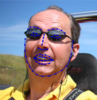

The Menpo Project — AAMs, CLMs, SDMs in Python
==============================================

	
	
	
	
	
	

The Menpo Project is an ecosystem of open-source software that provides end-to-end solution for 2D and 3D deformable modeling. The project includes training and fitting code for **Active Appearance Models**, **Constrained Local Models**, and **Supervised Decent Method**. It also provides tooling for **annotation of bulk data** for model training, a **benchmarking suite** to fairly evalulate the performance of methods.

The majority of the software consists of a family of Python packages, each designed to solve one problem well:

#### menpo
The heart of the Menpo Project. `menpo` contains all core functionality needed for the project in well tested, mature, stable package. `menpo` is the `numpy` of the Menpo ecosystem - the foundation upon which all else is built.

#### menpofit
menpofit contains implementations of state of the art 2D deformable models, including Active Appearance Models, Constrained Local Models, and Supervised Decent Method. Each implementation includes training and fitting code. menpofit contains the crown jewels of the Menpo Project - most people are interested in using the Menpo Project for the `menpofit` package.

#### menpodetect
menpodetect contains detection methods.
`menpodetect` works on and returns images and landmarks defined in `menpo`.

#### menpo3d
Menpo3D is a specialized library for working with 3D data. It is largely separate from the core `menpo` library as it has dependencies on a number of large, 3D specific projects (like VTK, mayavi, assimp) which many people using the Menpo Project would have no use for. You'll want to install `menpo3d` if you need to import and export 3D mesh data or perform advanced mesh processing.

#### menpowidgets
A key goal of Menpo is to accelerate research in 2D and 3D computer vision by providing powerful tools for visualization of results. `menpowidgets` contains a collection of IPython Notebook Widgets for interactive inspection the state of Menpo objects.

The Menpo Project also includes non-Python components that complement the core Menpo Libraries.

#### [landmarker.io](https://www.landmarker.io)
- An interactive tool to place landmarks on images and meshes
- Quickly landmark a single image, or organize a large annotation effort for thousands of files

# Motivation

## The Menpo Team

The Menpo Team are a group of researchers from the Intelligent Behavior Understandings Group (iBUG) in the Department of Computing, Imperial College London. Follow [@teammenpo](www.twitter.com/teammenpo) for updates on the Menpo Project, or tweet at us any questions you have.

## What kinds of problems does the Menpo Team work on?

Although each member of the Menpo Team is perusing an individual research direction, there are many areas where their research overlaps. All members are working in Computer Vision, and most in some form of 2D or 3D deformable modeling.
This means that all researchers in the team need to solve similar problems, and as a result, we wanted to build tools that made the following kinds of tasks easy:

#### Working with landmarks
- Attach *landmarks* - sparse spatial points with semantic meaning - to images and 2D and 3D shapes
- Import and export a range landmark file formats produced by different research groups

#### Working with images
- Import and export a range of image file formats
- Perform common image operations  (e.g. resizing, cropping, masking, warping)
  - Perform these in the context of having landmarks (e.g. crop around a set of landmarks to retain only the part of an image that is of interest)
- Extract features like SIFT, HOG, IGO on images
- For all image operations, track how any landmarks on an image are transformed

#### Working with shapes
- Import and export a range of 3D mesh file formats
- Represent a range of spatial datatypes, like pointclouds, triangle meshes, and directed and undirected graphs
  - Have n-dimensional representations where possible, so code can be reused for 2D and 3D cases
- Perform spatial transformations to shapes (translate, rotate, affine warp, Thin Plate Spline warp)
  - For all transformations, track how any landmarks on a shape are transformed

#### Linear algebra on data
- An ability to reliably move between a linear algebra parameterization of some data (an array of values) to a rich representation that is useful for interactive work (an object with methods)
- Perform statistical modeling on images and shapes (Principal Component Analysis)

The above requirements are the building blocks of the kind of deformable modeling research our team does. If we had a codebase that implemented all of these features well, it would be easy to express a wide variety of computer vision and deformable modeling problems.

## Why 'Menpo'?

> Menpo were facial armours which covered all or part of the face and provided 
> a way to secure the top-heavy kabuto (helmet). The Shinobi-no-o (chin cord) 
> of the kabuto would be tied under the chin of the menpo. There were small 
> hooks called ori-kugi or posts called odome located on various places to 
> help secure the kabuto's chin cord.
>
> --- Wikipedia, Menpo

## Engineering goals

Outside of the raw features needed, the team also needed flexible software that could be relied upon. That meant:

- The ability to work in an interactive environment where new research ideas can be quickly explored
- Cross platform (Linux, OS X, Windows)
- One click install and removal. No outside dependencies needed.
- Extensively tested and documented

It's from these requirements, and a desire by the team to make high quality open source research software, that the Menpo Project was born.

# This website

This website focuses on explaining the core Menpo abstractions and datatypes which are heavily reused throughout all of the Menpo Project. If you are new to the project, this website is the best way to quickly get up to speed with how to use Menpo.

As is hopefully now clear, the core concepts and datatypes defined in `menpo` are reused across all of the Menpo Project. We've worked hard to keep this core API as compact as possible, as we know from experience it's never pleasant trying to get to grips with another projects sprawling API and design patterns if you just want to get a job done.

The rest of this website is devoted to getting you to grips with the core `menpo` concepts and abstractions as quickly as possible. If you are at all interested in using any part of the Menpo Project, the 15 minutes it will take you to read through this website will be hugely beneficial to getting started quickly.

There will be examples throughout, and in fact all future pages of this website will be generated from an IPython notebook, so you can install Menpo, and follow along, trying and tweaking examples as you go.

As a final note, if you are only interested in using Menpo as a black box for some of the menpofit functionality, you are invited to checkout `menpocli`, our Command Line Interface. This is a cross platform set of executables for performing landmark detection on images, and requires no knowledge of Python or the rest of this website.

*taken from menpo `README.md`*

Usage
-----
Menpo makes extensive use of Jupyter Notebooks to explain functionality of the 
package. These Notebooks are hosted in the 
[menpo/menpo-notebooks](https://github.com/menpo/menpo-notebooks) repository. 
We strongly suggest that after installation you:

  1. Download the [latest version of the notebooks][notebooks_gh]
  2. Conda install Jupyter notebook and IPython: `conda install jupyter ipython notebook`
  3. Run `jupyter notebook`
  4. Play around with the notebooks.
  
[notebooks_gh]: https://github.com/menpo/menpo-notebooks/releases

Want to get a feel for Menpo without installing anything? You can browse the 
notebooks straight from the [menpo website](http://www.menpo.io/notebooks.html).

Other Menpo projects
--------------------
Menpo is designed to be a core library for implementing algorithms within
the Machine Learning and Computer Vision fields. For example, we have developed
a number of more specific libraries that rely on the core components of Menpo:

  - [menpofit][mf_gh]: Implementations of state-of-the-art deformable modelling
    algorithms including Active Appearance Models, Constrained Local Models
    and the Supervised Descent Method.
  - [menpo3d][m3d_gh]: Useful tools for handling 3D mesh data including
    visualization and an OpenGL rasterizer. The requirements of this package
    are complex and really benefit from the use of conda!
  - [menpodetect][md_gh]: A package that wraps existing sources of object 
    detection. The core project is under a BSD license, but since other projects 
    are wrapped, they may not be compatible with this BSD license. Therefore, 
    we urge caution be taken when interacting with this library for 
    non-academic purposes.
  - [menpowidgets][mw_gh]: This package provides high level object
    viewing classes using Matplotlib and Jupyter. Jupyter notebooks
    are therefore required to this package - and Menpo also
    implicitly relies on menpowidgets for any widget functionality.
 
[mf_gh]: https://github.com/menpo/menpofit
[m3d_gh]: https://github.com/menpo/menpo3d
[md_gh]: https://github.com/menpo/menpodetect
[mw_gh]: https://github.com/menpo/menpowidgets

*taken from website FAQs*

Frequently Asked Questions (FAQ)
================================

  1. [What license is Menpo under?](#what-license-is-menpo-under)
  2. [How do I cite Menpo?](#citation)
  3. [How do I install a development version?](#how-do-i-install-a-development-version)

### What license is Menpo under?
Menpo is under the 3-clause BSD license which can be found 
[here](https://github.com/menpo/menpo/blob/master/LICENSE.txt). This means
that you are free to use Menpo in commercial products as long as you retain
our copyright notice and do not use the *Imperial College London* name to
promote your product. A list of contributors is given within the
[authors file](https://github.com/menpo/menpo/blob/master/AUTHORS.txt).

### How do I cite Menpo?
Menpo has been accepted to appear at the 
[ACM Multimedia 2014](http://acmmm.org/2014/) conference.

<pre>
Joan Alabort-i-Medina, Epameinondas Antonakos, James Booth, Patrick Snape and Stefanos Zafeiriou, "Menpo: A Comprehensive Platform for Parametric Image Alignment and Visual Deformable Models.", In Proceedings of the international conference on Multimedia, ACM, 2014.
</pre> [[Bibtex](paper/menpo.bib)] [[pdf](paper/Menpo_ACM_MM_2014.pdf)]

Therefore, this publication is the reference paper to cite if you use Menpo 
within **any academic paper**. We request that you if do use Menpo for an
academic publication within any displicine that you cite Menpo!

### How do I install a development version?

Please see the [Development installation instructions](/installation/development.md)

*taken from the website homepage*

Welcome to the Menpo project!
=============================

The Menpo project is a set of Python libraries for manipulating data
that is particularly useful for Machine Learning and Computer Vision. The core
``menpo`` library contains a number of powerful tools for manipulating
*annotated* image and mesh data. ``menpo`` focuses on making importing, 
manipulating and visualizing data as simple as possible. This makes us strong 
supporters of projects like the [Jupyter notebook](http://jupyter.org/).

The Menpo project also includes another tool that makes annotating new datasets
even easier! Freely available a [landmarker.io](https://www.landmarker.io), the 
landmarker is a tool that makes it simple to annotate new images.

On top of the core ``menpo`` library, we have implemented a number of other 
libraries that utilize ``menpo`` for more specific purposes. Currently, the
Menpo project libraries include:

  - ``menpo``: the core library containing all the essential classes for
    data manipulation including transforms, warping, landmarks, importing and
    exporting.  
    [![Github Release][m_shield]][m_gh] [![BSD License][bsd_shield]][m_lic]
  - ``menpofit``: a statistical modelling toolkit, providing all the tools 
    required to build, fit and test deformable models like
    **Active Appearance Models**, **Constrained Local Models** and
    **Supervised Descent Method**.  
    [![Github Release][mf_shield]][mf_gh] [![BSD License][bsd_shield]][mf_lic]
  - ``menpo3d``: specific tools for visualizing and manipulating 3D data such
    as meshes. This package contains a lot of complex dependencies, including
    an OpenGL based rasterizer.  
    [![Github Release][m3d_shield]][m3d_gh] [![BSD License][bsd_shield]][m3d_lic]
  - ``menpodetect``: wraps a number of existing projects that can perform
    object detection. Not all of the wrapped projects fall under the same
    BSD license and so care must be taken when using this project to adhere
    to the sub-project licenses.  
    [![Github Release][md_shield]][md_gh] [![BSD License][bsd_shield]][md_lic]
  - ``menpowidgets``: provides Jupyter notebook interactive widgets. These widgets
    are for all of the Menpo project subprojects including ``menpo`` and ``menpofit``.  
    [![Github Release][mw_shield]][mw_gh] [![BSD License][bsd_shield]][mw_lic]
    
  [bsd_shield]: http://img.shields.io/badge/License-BSD-green.svg
  [m_shield]: http://img.shields.io/github/release/menpo/menpo.svg
  [m_gh]: http://github.com/menpo/menpo
  [m_lic]: https://github.com/menpo/menpo/blob/master/LICENSE.txt
  [mf_shield]: http://img.shields.io/github/release/menpo/menpofit.svg
  [mf_gh]: http://github.com/menpo/menpofit
  [mf_lic]: https://github.com/menpo/menpofit/blob/master/LICENSE.txt
  [m3d_shield]: http://img.shields.io/github/release/menpo/menpo3d.svg
  [m3d_gh]: http://github.com/menpo/menpo3d
  [m3d_lic]: https://github.com/menpo/menpo3d/blob/master/LICENSE.txt
  [md_shield]: http://img.shields.io/github/release/menpo/menpodetect.svg
  [md_gh]: http://github.com/menpo/menpodetect
  [md_lic]: https://github.com/menpo/menpodetect/blob/master/LICENSE.txt
  [mw_shield]: http://img.shields.io/github/release/menpo/menpowidgets.svg
  [mw_gh]: http://github.com/menpo/menpowidgets
  [mw_lic]: https://github.com/menpo/menpowidgets/blob/master/LICENSE.txt

### Installation
The Menpo project is written in **Python** and we provide a simple and easy 
method of installation using [Conda](http://conda.pydata.org/). We suggest you 
head over to the 
[installation instructions](installation/index.md) to get 
started. We recommend the use of ``conda`` due to the fact that the Menpo projects also include compiled ``C/C++`` code which may be complicated to compile on various platforms.

### Citing the Menpo project
<pre>
Joan Alabort-i-Medina, Epameinondas Antonakos, James Booth, Patrick Snape and Stefanos Zafeiriou, "Menpo: A comprehensive platform for parametric image alignment and visual deformable models", In Proceedings of the ACM International Conference on Multimedia, MM ’14, pages 679-682, New York, NY, USA, 2014. ACM.
</pre> [[Bibtex](paper/menpo.bib)] [[pdf](paper/Menpo_ACM_MM_2014.pdf)]
