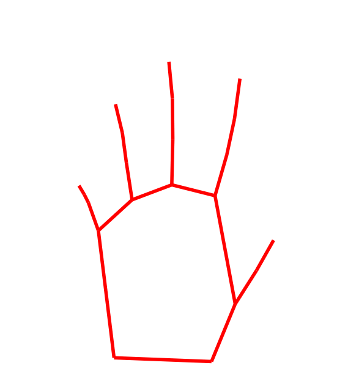

  
   
   
  
  
  
  
  
  <iframe src="https://ghbtns.com/github-btn.html?user=menpo&repo=menpofit&type=star&count=true" frameborder="0" scrolling="0" width="170px" height="20px"></iframe>
   

`menpofit` is Menpo Project's Python package for building, fitting and manipulating state-of-the-art 2D deformable models.

We strongly advise you to first visit the [**Basics**](basics.md "Basic concepts and assumptions in menpofit") section in order to understand the fundamental concepts and assumptions that are made in `menpofit`, before reading about the actual methods.

In practice, `menpofit` is providing solutions to the following problems:

#### Affine Image Alignment
> An Affine Image Alignment algorithm aims to find the optimal alignment between an input image and a template image with respect to the parameters of an affine transform.

The methods that are implemented in `menpofit` are:
- [**Lucas-Kanade (LK)**](lk.md "Lucas-Kanade")
  - _Optimization Algorithms:_ Forward Additive, Forward/Inverse Compositional
  - _Residuals:_ SSD, Fourier SSD, ECC, Gradient Correlation, Gradient Images

#### Deformable Image Alignment
> Deformable Image Alignment aims to get the otpimal alignment between an input image and a template image with respect to the parameters of a statistical parametric shape model.

The methods that are implemented in `menpofit` are:
- [**Active Template Model (ATM)**](atm.md "Active Template Model")
  - _Model Variants:_ Holistic, Patch-based, Masked, Linear, Linear Masked
  - _Optimization Algorithm:_ Lucas-Kanade Gradient Descent

#### Landmark Localization
A deformable object is commonly represented with a set of landmarks which correspond to semantically meaningful parts.

> Landmark Localization is the problem of localizing the landmark points that correspond to a deformable model in an input image.

The models that are implemented in `menpofit` are:
- [**Active Appearance Model (AAM)**](aam.md "Active Appearance Model")
  - _Model Variants:_ Holistic, Patch-based, Masked, Linear, Linear Masked
  - _Optimization Algorithms:_ Lucas-Kanade, Cascaded-Regression
- [**Active Pictorial Structures (APS)**](aps.md "Active Pictorial Structures")
  - _Model Variant:_ Generative
  - _Optimization Algorithm:_ Weighted Gauss-Newton Optimisation with fixed Jacobian and Hessian
- [**Constrained Local Model (CLM)**](clm.md "Constrained Local Model")
  - Active Shape Model
  - Regularised Landmark Mean Shift
- [**Ensemble of Regression Trees (ERT)**](ert.md "Ensemble of Regression Trees")
  - \[provided by [DLib](http://dlib.net/ "dlib C++ Library")\]
- [**Supervised Descent Method (SDM)**](sdm.md "Supervised Descent Method")
  - _Model Variants:_ Non Parametric, Parametric Shape, Parametric Appearance, Fully Parametric

Finally, please see the [References](references.md "List of implemented papers") for an indicative list of papers that are implemented in `menpofit`.

#### Deformable Objects
Note that all the examples of this `menpofit` user guide are based on the human face for demonstration purposes.
The Menpo Project is **not** specific to the human face and can be used for any kind of deformable object, such as
the human body (skeleton), human hand, cat face and car sideview.

  
  
   
  
  
   
  

