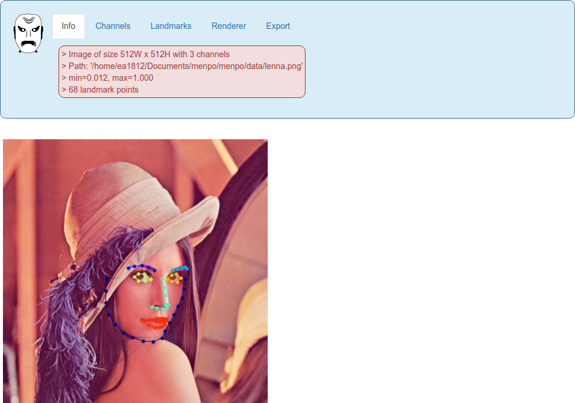

Visualizing Objects
===================
In the Menpo Project, we take an opinionated stance that visualization is a key part of working with visual data.
Therefore, we tried to make the mental overhead of visualizing objects as low as possible.
As a matter of fact, we made visualization a key concept directly on our data containers, rather than requiring extra imports in order to view your data.

We also took a strong step towards simple visualization by integrating some of our objects with visualization widgets for the Jupyter notebook.
Remember that our widgets live on their own repository - [`menpowidgets`](../menpowidgets/index.md).

1. [Visualizing 2D Images](#image)
2. [Visualizing A List Of 2D Images](#images)
3. [Visualizing A 2D PointCloud](#pointcloud)
4. [Visualizing In 3D](#3d)

---------------------------------------

<p><div style="background-color: #F2DEDE; width: 100%; border: 1px solid #A52A2A; padding: 1%;">
<p style="float: left;"><i class="fa fa-exclamation-circle" aria-hidden="true" style="font-size:4em; padding-right: 15%; padding-bottom: 10%; padding-top: 10%;"></i></p>
We highly recommend that you render all matplotlib figures <b>inline</b> the Jupyter notebook for the best `menpowidgets` experience.
This can be done by running</br>
<center><code>%matplotlib inline</code></center>
in a cell. Note that you only have to run it once and not in every rendering cell.
</div></p>


### 1. Visualizing 2D Images {#image}
Without further ado, a quick example of viewing a 2D image:
```python
%matplotlib inline
import menpo.io as mio

image = mio.import_builtin_asset.lenna_png()
image.view()
```
<center>
  
</center>

Viewing the image landmarks:
```python
image.view_landmarks()
```
<center>
  
</center>

Viewing the image with a native IPython widget:
```python
image.view_widget()
```
<center>
  
</center>

### 2. Visualizing A List Of 2D Images {#images}
Visualizing a `list` of images is also incredibly simple if you are using the Jupyter notebook and have the `menpowidgets` package installed:
```python
from menpowidgets import visualize_images

# import_images is a generator, so we must exhaust the generator before
# we can visualize the list. This is because the widget allows you to
# jump arbitrarily around the list, which cannot be done with generators.
images = list(mio.import_images('/path/to/images/'))
visualize_images(images)
```
<video width="100%" autoplay loop>
  <source src="media/visualize_images.mp4" type="video/mp4">
Your browser does not support the video tag.
</video>


### 3. Visualizing A 2D PointCloud {#pointcloud}
Visualizing `PointCloud` objects and subclasses is a very familiar experience:
```python
pcloud = mio.import_builtin_asset.breakingbad_pts().lms
pcloud.view()
```
<center>
  
</center>


### 4. Visualizing In 3D {#3d}
`menpo` natively supports 3D objects, such as triangulated meshes, as our base classes are n-dimensional. However, as viewing in 3D is a much more complicated experience, we have segregated the 3D viewing package into one of our sub-packages: [`menpo3d`](../menpo3d/index.md).

If you try to view a 3D `PointCloud` without having `menpo3d` installed, you will receive an exception asking you to install it.

`menpo3d` also comes with many other complicated pieces of functionality for 3D meshes such as a rasterizer. We recommend you look at [`menpo3d`](../menpo3d/index.md) if you want to use `menpo` for 3D mesh manipulation.
