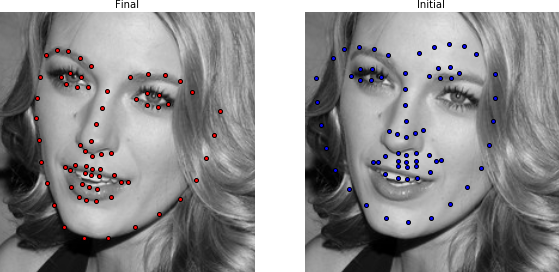

Visualizing Objects
===================
In the Menpo Project, we take an opinionated stance that visualization is a key part of generating research.
Therefore, we tried to make the mental overhead of visualizing objects as low as possible.

We also took a strong step towards simple visualization by integrating some of our objects with visualization widgets for the Jupyter notebook.
Remember that our widgets live on their own repository, called [**menpowidgets**](../menpowidgets/index.md).

1. [Visualizing Models](#models)
2. [Visualizing Fitting Result](#result)

---------------------------------------

<p><div style="background-color: #F2DEDE; width: 100%; border: 1px solid #A52A2A; padding: 1%;">
<p style="float: left;"><i class="fa fa-exclamation-circle" aria-hidden="true" style="font-size:4em; padding-right: 15%; padding-bottom: 10%; padding-top: 10%;"></i></p>
We highly recommend that you render all matplotlib figures <b>inline</b> the Jupyter notebook for the best <a href="../menpowidgets/index.md"><em>menpowidgets</em></a> experience.
This can be done by running</br>
<center><code>%matplotlib inline</code></center>
in a cell. Note that you only have to run it once and not in every rendering cell.
</div></p>


### <a name="models"></a>1. Visualizing Models
All `menpofit` models provide functionalities for visualizing themselves. For example,
the AAM that we trained in the [Training](training.md) section can be visualized with an interactive widget as:

```python
%matplotlib inline
aam.view_aam_widget()
```

<video width="100%" autoplay loop>
  <source src="media/basics_view_aam_widget.mp4" type="video/mp4">
Your browser does not support the video tag.
</video>

We can visualize only the multi-scale shape model as:

```python
aam.view_shape_models_widget()
```

<video width="100%" autoplay loop>
  <source src="media/view_shape_models_widget.mp4" type="video/mp4">
Your browser does not support the video tag.
</video>

or the appearance models as:

```python
aam.view_appearance_models_widget()
```

<video width="100%" autoplay loop>
  <source src="media/basics_view_appearance_models_widget.mp4" type="video/mp4">
Your browser does not support the video tag.
</video>

The same visualization widgets can be found in other models, such as ATM, CLM etc.


### <a name="result"></a>2. Visualizing Fitting Result
The fitting result objects shown returned by the fitting methods in the [Fitting](fitting.md) section can be easily visualized.
Specifically, the initial and final shapes can be rendered as:

```python
result.view(render_initial_shape=True)
```
<center>
  
</center>

Similarly, the shapes acquired at each iteration can be visualized as:

```python
result.view_iterations()
```
<center>
  
</center>

and the corresponding errors as:

```python
result.plot_errors()
```
<center>
  
</center>

Finally, a fitting result can also be analysed through an interactive widget as:

```python
result.view_widget()
```
<video width="100%" autoplay loop>
  <source src="media/basics_result_view_widget.mp4" type="video/mp4">
Your browser does not support the video tag.
</video>
