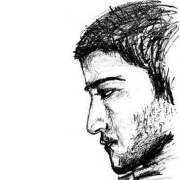

The Menpo Team
==============

The Menpo Team are a group of researchers from the [**Intelligent Behaviour Understanding Group (iBUG)**][ibug] in the
Department of Computing, [**Imperial College London**][imperial], UK.

We are enthusiastic about social coding and we are very keen to receive contributions from anyone who is interested. If you feel like you want to contribute in any way, please head over to our
[Github page](http://www.github.com/menpo/)!

---------------------------------------

### Joan Alabort-i-Medina

 
<a href="http://ibug.doc.ic.ac.uk/people/jalabort-i-medina" target="_blank"><i class="fa fa-home" style="color: black; font-size:120%;"></i></a>
<a href="mailto:joan.alabort@gmail.com" target="_blank"><i class="fa fa-envelope-square" style="color: black; font-size:120%;"></i></a>
<a href="http://github.com/jalabort" target="_blank"><i class="fa fa-github" style="color: black; font-size:120%;"></i></a>
<a href="http://ibug.doc.ic.ac.uk/people/jalabort-i-medina" target="_blank"><i class="fa fa-bug" style="color: black; font-size:120%;"></i></a>
<a href="https://scholar.google.co.uk/scholar?hl=en&q=joan+alabort-i-medina" target="_blank"><i class="fa fa-graduation-cap" style="color: black; font-size:120%;"></i></a>
<a href="https://www.facebook.com/joan.alabort" target="_blank"><i class="fa fa-facebook-square" style="color: black; font-size:120%;"></i></a>
<a href="https://www.linkedin.com/in/joan-alabort-3b13b315" target="_blank"><i class="fa fa-linkedin-square" style="color: black; font-size:120%;"></i></a>
<a href="https://twitter.com/JoanAlabort" target="_blank"><i class="fa fa-twitter-square" style="color: black; font-size:120%;"></i></a>

Joan received his B.Sc. degree in Computer Science and Engineering from the [Universitat Autonoma de Barcelona](http://www.uab.cat/web/universitat-autonoma-de-barcelona-1345467954774.html), Barcelona, Spain, in 2008, and the M.Sc. degree in Visual Information Processing from [Imperial College London][imperial], U.K., in 2011. He is currently pursuing a Ph.D. degree at the Department of Computing, Imperial College London, under the supervision of [Dr. Stefanos Zafeiriou][stefanos_personal]. He was also the recipient of the 2013 Qualcomm Innovation Fellowship. His research interests lie in the fields of Compute Vision, Machine Learning and Human-Computer Interaction, with particular focus on Deformable Face Tracking and Affect Analysis.

---------------------------------------

### Epameinondas Antonakos

 
<a href="http://nontas.github.io/" target="_blank"><i class="fa fa-home" style="color: black; font-size:120%;"></i></a>
<a href="mailto:antonakosn@gmail.com" target="_blank"><i class="fa fa-envelope-square" style="color: black; font-size:120%;"></i></a>
<a href="http://github.com/nontas" target="_blank"><i class="fa fa-github" style="color: black; font-size:120%;"></i></a>
<a href="http://ibug.doc.ic.ac.uk/people/eantonakos" target="_blank"><i class="fa fa-bug" style="color: black; font-size:120%;"></i></a>
<a href="https://scholar.google.es/citations?user=ViIpE70AAAAJ" target="_blank"><i class="fa fa-graduation-cap" style="color: black; font-size:120%;"></i></a>
<a href="https://www.facebook.com/antonakosn" target="_blank"><i class="fa fa-facebook-square" style="color: black; font-size:120%;"></i></a>
<a href="https://uk.linkedin.com/in/epameinondas-antonakos-32b62454" target="_blank"><i class="fa fa-linkedin-square" style="color: black; font-size:120%;"></i></a>
<a href="https://twitter.com/antonakosn" target="_blank"><i class="fa fa-twitter-square" style="color: black; font-size:120%;"></i></a>

Nontas received his Diploma degree in Electrical and Computer Engineering from [National Technical University of Athens (NTUA)](http://www.ntua.gr/), Greece, in 2011. During 2011-2012, he was a Research Assistant in the [Computer Vision, Speech Communication & Signal Processing (CVSP) Group](http://cvsp.cs.ntua.gr/), School of Electrical and Computer Engineering, NTUA, Greece, under the supervision of Prof. Petros Maragos. Currently, he is a Ph.D. candidate in the Department of Computing, [Imperial College London][imperial], U.K., working at the iBUG group under the supervision of [Dr. Stefanos Zafeiriou][stefanos_personal]. His research interests lie in the fields of Computer Vision, Pattern Recognition, Statistical Machine Learning and Human-Computer Interaction with particular focus on developing methods for the accurate and robust landmarks localization, as well as the unsupervised construction of deformable models that are efficient under unconstrained conditions.

---------------------------------------

### James Booth

 
<a href="http://www.jamesabooth.com" target="_blank"><i class="fa fa-home" style="color: black; font-size:120%;"></i></a>
<a href="mailto:jabooth@gmail.com" target="_blank"><i class="fa fa-envelope-square" style="color: black; font-size:120%;"></i></a>
<a href="http://github.com/jabooth" target="_blank"><i class="fa fa-github" style="color: black; font-size:120%;"></i></a>
<a href="http://ibug.doc.ic.ac.uk/people/jbooth" target="_blank"><i class="fa fa-bug" style="color: black; font-size:120%;"></i></a>
<a href="https://scholar.google.co.uk/citations?user=T7F42LQAAAAJ" target="_blank"><i class="fa fa-graduation-cap" style="color: black; font-size:120%;"></i></a>
<a href="https://www.facebook.com/jabooth" target="_blank"><i class="fa fa-facebook-square" style="color: black; font-size:120%;"></i></a>
<a href="https://www.linkedin.com/in/jabooth" target="_blank"><i class="fa fa-linkedin-square" style="color: black; font-size:120%;"></i></a>
<a href="https://twitter.com/jamesabooth" target="_blank"><i class="fa fa-twitter-square" style="color: black; font-size:120%;"></i></a>

James is a Ph.D. candidate supervised by [Dr. Stefanos Zafeiriou][stefanos_personal] in the Department of Computing, [Imperial College London][imperial], UK. His thesis covers the construction and application of highly accurate 3D deformable facial models. James is also an honorary member of the Craniofacial Unit at [Great Ormond Street Hospital London](http://www.gosh.nhs.uk/), where he applies his research to advancing the state of the art in craniofacial surgery planning and outcome measurements. James was named the 2015 European Qualcomm Innovation Fellowship winner.

---------------------------------------

### Patrick Snape

 
<a href="http://patricksnape.github.io/" target="_blank"><i class="fa fa-home" style="color: black; font-size:120%;"></i></a>
<a href="mailto:p.snape@imperial.ac.uk" target="_blank"><i class="fa fa-envelope-square" style="color: black; font-size:120%;"></i></a>
<a href="http://github.com/patricksnape" target="_blank"><i class="fa fa-github" style="color: black; font-size:120%;"></i></a>
<a href="http://ibug.doc.ic.ac.uk/people/psnape" target="_blank"><i class="fa fa-bug" style="color: black; font-size:120%;"></i></a>
<a href="https://scholar.google.co.uk/citations?user=L-sUZmUAAAAJ" target="_blank"><i class="fa fa-graduation-cap" style="color: black; font-size:120%;"></i></a>
<a href="https://www.facebook.com/patrick.snape" target="_blank"><i class="fa fa-facebook-square" style="color: black; font-size:120%;"></i></a>
<a href="https://www.linkedin.com/in/patrick-snape-0a6a9b26" target="_blank"><i class="fa fa-linkedin-square" style="color: black; font-size:120%;"></i></a>
<a href="https://twitter.com/berecursive" target="_blank"><i class="fa fa-twitter-square" style="color: black; font-size:120%;"></i></a>

Patrick received his MEng in Computer Science from [Imperial College London][imperial], U.K. in 2012. As of October 2012, he is a Ph.D. candidate under the supervision of [Dr. Stefanos Zafeiriou][stefanos_personal]. He was also the recipient of the 2014 Qualcomm Innovation Fellowship. His research focus is investigating the recovery of 3D shape from 2D images. His current research interests include Shape-from-Shading, deformable modelling, 3D image alignment and photometric stereo.

---------------------------------------

### George Trigeorgis

 
<a href="http://trigeorgis.com/" target="_blank"><i class="fa fa-home" style="color: black; font-size:120%;"></i></a>
<a href="mailto:g.trigeorgis@imperial.ac.uk" target="_blank"><i class="fa fa-envelope-square" style="color: black; font-size:120%;"></i></a>
<a href="http://github.com/trigeorgis" target="_blank"><i class="fa fa-github" style="color: black; font-size:120%;"></i></a>
<a href="http://ibug.doc.ic.ac.uk/people/gtrigeorgis" target="_blank"><i class="fa fa-bug" style="color: black; font-size:120%;"></i></a>
<a href="https://scholar.google.com/citations?user=WL_xXbQAAAAJ" target="_blank"><i class="fa fa-graduation-cap" style="color: black; font-size:120%;"></i></a>
<a href="https://facebook.com/gtrigeorgis" target="_blank"><i class="fa fa-facebook-square" style="color: black; font-size:120%;"></i></a>
<a href="https://www.linkedin.com/in/trigeorgis" target="_blank"><i class="fa fa-linkedin-square" style="color: black; font-size:120%;"></i></a>
<a href="https://twitter.com/trigeorgis" target="_blank"><i class="fa fa-twitter-square" style="color: black; font-size:120%;"></i></a>

George received his MEng in Computer Science from [Imperial College London][imperial], U.K. in 2013. As of October 2013, he is a Ph.D. candidate under the supervision of [Dr. Stefanos Zafeiriou][stefanos_personal]. His research interests include deep learning, matrix factorisation, computer vision, and emotion recognition.

---------------------------------------

### Dr. Stefanos Zafeiriou

 
<a href="https://wp.doc.ic.ac.uk/szafeiri/" target="_blank"><i class="fa fa-home" style="color: black; font-size:120%;"></i></a>
<a href="mailto:s.zafeiriou@imperial.ac.uk" target="_blank"><i class="fa fa-envelope-square" style="color: black; font-size:120%;"></i></a>
<a href="http://ibug.doc.ic.ac.uk/people/szafeiriou" target="_blank"><i class="fa fa-bug" style="color: black; font-size:120%;"></i></a>
<a href="https://scholar.google.co.uk/citations?user=QKOH5iYAAAAJ" target="_blank"><i class="fa fa-graduation-cap" style="color: black; font-size:120%;"></i></a>
<a href="https://www.linkedin.com/in/stefanos-zafeiriou-3969125" target="_blank"><i class="fa fa-linkedin-square" style="color: black; font-size:120%;"></i></a>

Stefanos is a Senior Lecturer (equivalent to Associate Professor) in Pattern Recognition/Statistical Machine Learning for Computer Vision in the Department of Computing, [Imperial College London][imperial], UK. He has been awarded one of the prestigious Junior Research Fellowships (JRF) from Imperial College London in 2011 to start his own independent research group. He is/has participated in more than 10 EU, British and Greek research projects. Dr. Zafeiriou currently serves as an Associate Editor in IEEE Transactions on Cybernetics and Image and Vision Computing journal. He has been guest editor in more than four special issues and co-organized more than five workshops/ special sessions in top venues such as CVPR/FG/ICCV/ECCV. He has co-authored more than 40 journal papers mainly on novel statistical machine learning methodologies applied to computer vision problems such as 2D/3D face and facial expression recognition, deformable object tracking, human behaviour analysis etc published in the most prestigious journals in his field of research (such as IEEE T-PAMI, IJCV, IEEE T-IP, IEEE T-NNLS, IEEE T-VCG, IEEE T-IFS etc).

[ibug]: http://ibug.doc.ic.ac.uk/
[imperial]: https://www.imperial.ac.uk/
[stefanos_personal]: https://wp.doc.ic.ac.uk/szafeiri/
